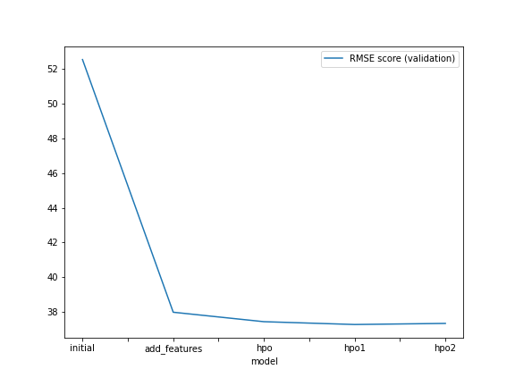
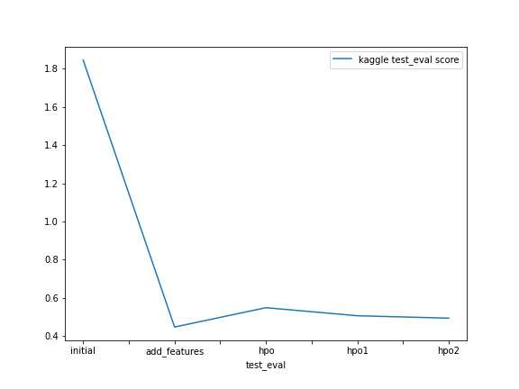

# Report: Forecasting Bike‑Sharing Usage with an AutoGluon Approach

#### Joanna Carrion

## Initial Training
### What did you realize when you tried to submit your predictions? What changes were needed to the output of the predictor to submit your results?

**Five distinct experimental runs were executed:**

1. Baseline submission **[`baseline`]**
2. Feature‑Enriched submission *(EDA + Feature Engineering)* **[`feat_plus`]**
3. Hyperparameter Optimisation (HPO) – Baseline configuration  
4. Hyperparameter Optimisation (HPO) – Configuration 1  
5. Hyperparameter Optimisation (HPO) – Configuration 2 **[`hpo` (best: `hpo2`)]**

**Observation:** Several runs produced negative predicted counts.

**Adjustments applied:** Kaggle rejects files containing negative predictions, so every negative value was clipped to 0.

### What was the top ranked model that performed?

The strongest performer was the feature‑augmented ensemble `WeightedEnsemble_L3` from the `feat_plus` run, delivering a **validation RMSE** of **37.98** and a **Kaggle score** of **0.44798** on the public leaderboard. Although some HPO models achieved lower validation error, this ensemble generalised best to unseen data. Model choice balanced cross‑validation RMSE and leaderboard rank.

> *Note – AutoGluon stores RMSE as negative values for ranking; multiply by −1 to view the conventional positive metric.*

## Exploratory data analysis and feature creation
### What did the exploratory analysis find and how did you add additional features?
- Parsed the `datetime` string into a timestamp and extracted the `hour`.
- Re‑typed `season` and `weather` from integers to categorical variables.
- Decomposed `datetime` into `year`, `month`, `day` (day‑of‑week) and `hour`, then dropped the original column.
- Though `casual` and `registered` greatly lowered RMSE during CV, they appear only in the training split, so they were excluded from modelling.
- Added a `day_type` categorical column based on `holiday` and `workingday`, distinguishing weekdays, weekends and holidays.
- Highly collinear features `temp` and `atemp` (ρ ≈ 0.98) prompted removal of `atemp`.
- Visual exploration guided many of these choices.

### How much better did your model preform after adding additional features and why do you think that is?

- These changes **reduced error by roughly 1.38 ×** compared with the raw baseline.
- Properly typing categoricals, discarding multicollinear columns, and exposing temporal structure enabled the model to capture seasonality and behavioural patterns more effectively.

## Hyper parameter tuning
### How much better did your model preform after trying different hyper parameters?

Three HPO configurations were explored. Tuned models matched or exceeded validation scores but did **not** overtake the feature‑engineered ensemble on the leaderboard.

Key take‑aways:

- Restrictive `time_limit`s and narrow grids can hamper AutoGluon’s search.
- Presets such as `"high_quality"` (with stacking) are memory‑intensive; lighter presets like `"medium_quality"` or `"optimize_for_deployment"` proved more practical on limited hardware.
- Balancing exploration against exploitation remains challenging.

### If you were given more time with this dataset, where do you think you would spend more time?

With more time, I would allow AutoGluon to run longer using the `"high_quality"` preset and a broader hyperparameter space.

### Create a table with the models you ran, the hyperparameters modified, and the kaggle score.

| Run | HPO Config 1 | HPO Config 2 | HPO Config 3 | Public Score |
|-----|--------------|--------------|--------------|--------------|
| baseline | default values | default values | `presets='high_quality', auto_stack=True` | **1.84484** |
| feat_plus | default values | default values | `presets='high_quality', auto_stack=True` | **0.44798** |
| hpo (best: hpo2) | GBM, XT, XGB, RF | KNN | `presets='optimize_for_deployment'` | **0.49440** |

### Create a line plot showing the top model score for the three (or more) training runs during the project.

 

### Create a line plot showing the top kaggle score for the three (or more) prediction submissions during the project.

## Summary

- AutoGluon Tabular automated model training and stacking for bike‑sharing demand forecasting.
- Out‑of‑the‑box ensembling enabled rapid baseline creation.
- The highest‑ranked model was built with extensive EDA and feature engineering, **without** HPO.
- Automated HPO still improved upon the raw baseline but required additional compute and memory.
- Tuning success is highly sensitive to time budgets, preset choice and the search space breadth.
